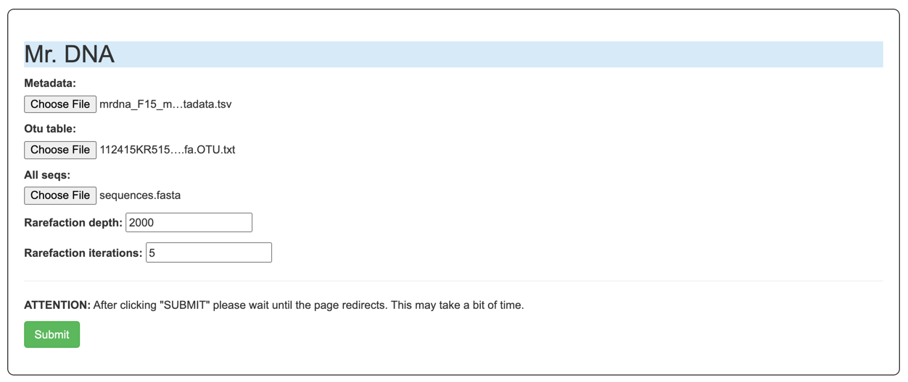
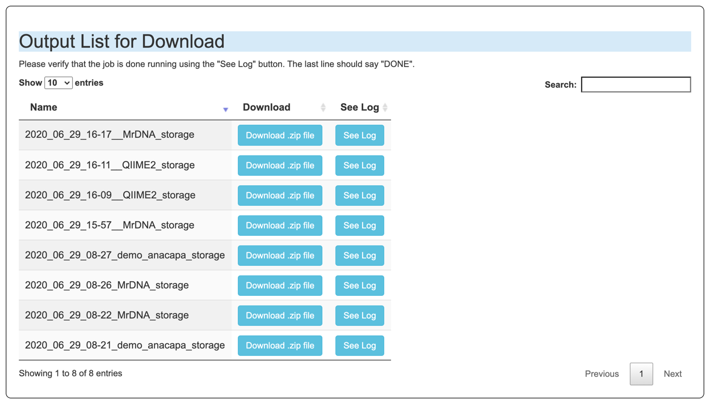
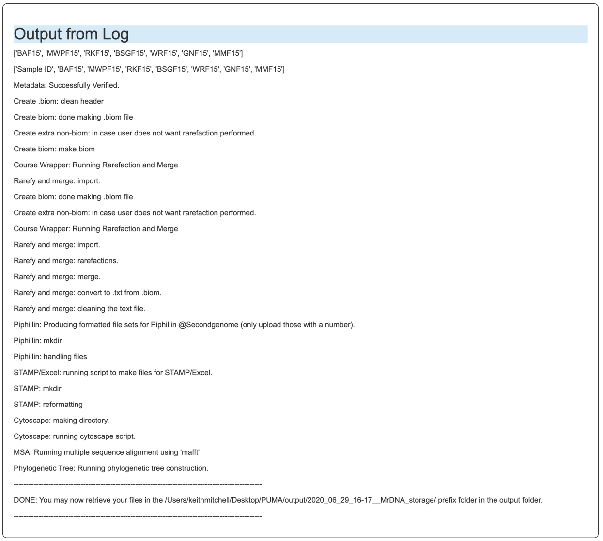
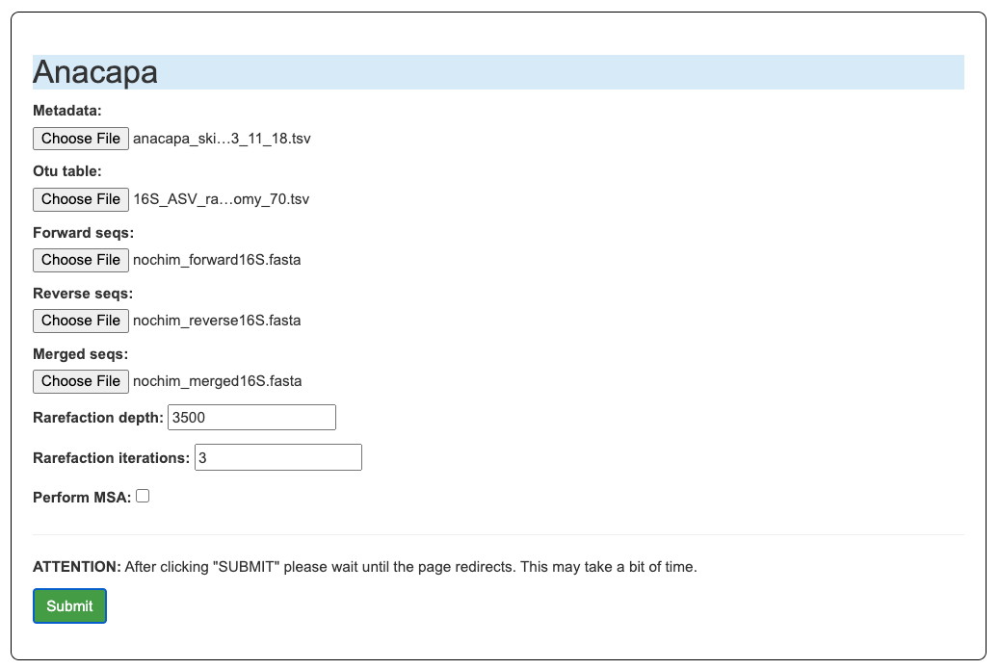
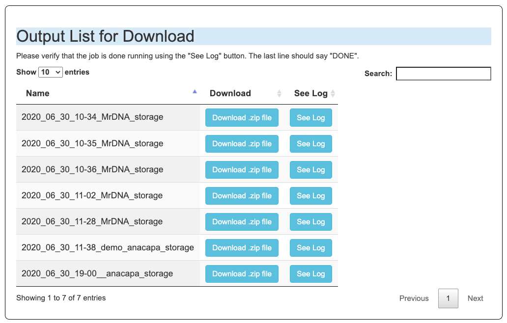
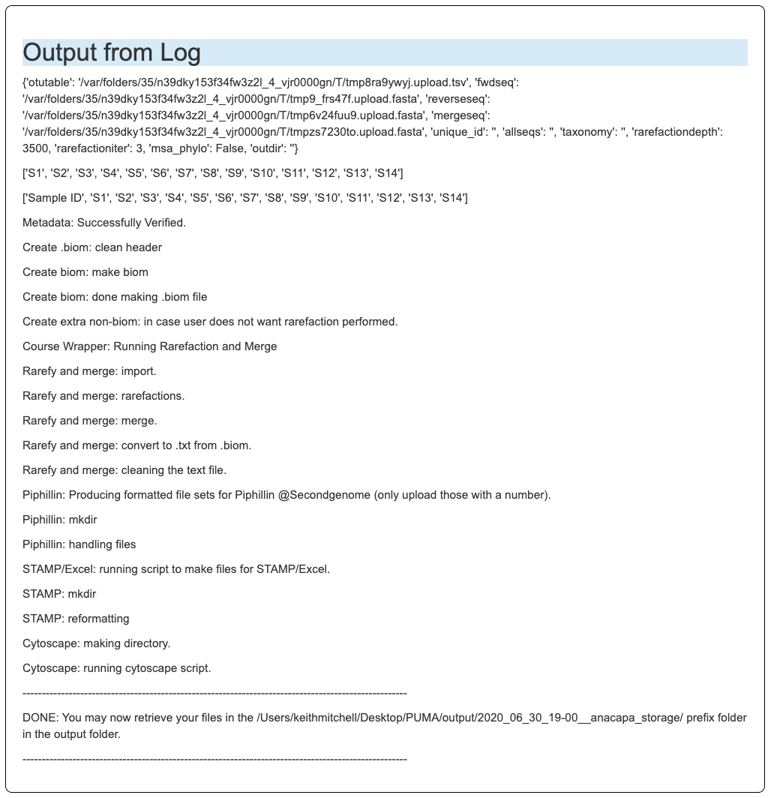
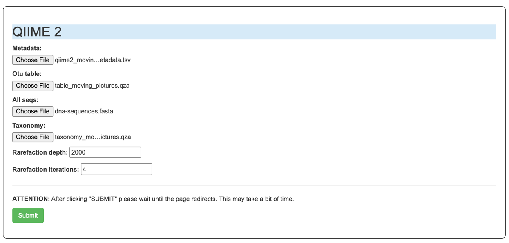

# PUMA (Pipeline for Unifying Microbiome Analysis) (Version 1.2)
Pre-print: https://doi.org/10.1101/482380
+ The Manual provided below will provide setup instructions as well as important tutorials for 
students/researchers for jumpstarting the analysis process with the various tools shown in the 
schema above.
    + Manual: https://ucla.app.box.com/s/ybehndj8phvj8eooqpcwxbqaxc3iaif2


## How to install: (MacOSx and Linux supported)
- If you are on Windows you can run the program by installing the Linux subsystem as shown here: https://www.onmsft.com/how-to/how-to-install-windows-10s-linux-subsystem-on-your-pc or you can use a VM of your choice. 

1. Install Conda for your operating system (https://docs.conda.io/projects/conda/en/latest/user-guide/install/)
    - for mac download the .pkg file
2. Run `git clone https://github.com/keithgmitchell/PUMA.git` by opening terminal in the folder of your choice.
3. `conda config --append channels conda-forge`; `conda config --append channels bioconda`
4. `cd PUMA`
4. `conda create -n puma_env --file requirements.txt`
    - Be sure to select "Yes" by clicking "y" when prompted. 
    - This may take 5-10 mins. 
5. `conda activate puma_env`
    - You should now see `(puma_env)` at the start of your terminal instead of `(base)`
6. `pip install -r pip_requirements.txt; mkdir temp`
7. For the CLI and the GUI run `python PumaCLI.py --help` and `python RunPuma.py` respectively.
8. A window will pop in your default browser, if it says "This site can not be reached" click refresh. 

## How to update your PUMA version:
1. Navigate to the directory where you ran part 2 of the installation process. 
    - For example:`cd /Users/keithmitchell/Desktop/Repositories/PUMA`
    - You should see files such as pip_requirements.txt, RunPuma.py, etc.
2. Run `git pull`
3. Run steps 1, 3-8 from "How to Install"

## How to run:
Results from running the PUMA scripts will produce output in the directory ‘output/’, 
or a specified output directory, with a prefix for the time the job was completed YEAR_MONTH_DAY_HOUR_MINUTE 
as well as a descriptive suffix such as ‘functional_profile’, ‘anacapa’, ‘MrDNA’, or ‘QIIME 2’ such as that 
shown in the Protocol sections. In addition; the CLI version provides the option for a user to specify an additional 
unique string to enable automation and parallel processing.

Be sure all sample names in the metadata and in the ASV/OTU table are matching an are only alphanumeric titles.
+ Running MrDNA example data: (using files from `examples/mrdna_F15`) (rarefaction depth and iterations randomly chosen)
    
    
    OR 
    
    ```
    python PumaCLI.py -type MrDNA -metadata examples/mrdna_F15/mrdna_F15_mock_metadata.tsv   
    -otutable examples/mrdna_F15/112415KR515F-pr.fasta.otus.fa.OTU.txt   
    -seqs examples/mrdna_F15/sequences.fasta -rarefactioniter 4 -rarefactiondepth 2000 -msa_phylo False
    ```
  
    - The output will look something like this where the top .zip file is the most recent job ran and check the log to make sure the job finished ok:
    
    


+ Running Anacapa Data: (using files in `examples/anacapa_skirball_S18`) (rarefaction depth and iterations randomly chosen)
    
    
    
    OR
    
    ```
    python PumaCLI.py -otutable examples/anacapa_skirball_S18/16S_ASV_raw_taxonomy_70.tsv \
    -fwdseq examples/anacapa_skirball_S18/nochim_forward16S.fasta \
    -mergeseq examples/anacapa_skirball_S18/nochim_merged16S.fasta \
    -reverseseq examples/anacapa_skirball_S18/nochim_reverse16S.fasta \
    -rarefactioniter 3 -rarefactiondepth 3500 -metadata examples/anacapa_skirball_S18/anacapa_skirball_metadata_3_11_18.tsv \
    -type anacapa -unique_id demo -msa_phylo False
    ```
    - The output will look something like this where the top .zip file is the most recent job ran and check the log to make sure the job finished ok:
        
        
    
+ Running QIIME2 data: (rarefaction depth and iterations randomly chosen)

    
    - QIIME2 Output view for example files:
    

+ Running the Functional Profile following input of file sets to piphillin (https://piphillin.secondgenome.com/):  

        python functional_profile.py \
        -i examples/piphillin/Keith_20180723210057.tar,examples/piphillin/Keith_20180723214258.tar \
        -o UCLA -metadata examples/anacapa_skirball_metadata_S18/anacapa_skirball_metadata_3_11_18.tsv      


## Version 1.3 (In progress)
+ Automated Rarefaction Depth Option
+ Capability to select output files (rather then produce all mentioned)
+ Include more tools such as the iTOL tool and any other requested (please create Issue if you have one in mind)
+ Include more file input types from other sequencing services (please create Issue if you have one in mind)
+ Fix the anacapa input functions.
+ Add picrust 2.0
+ Add merge files option that includes the metadata. 
+ upload standard otu and seqs
+ add rarefaction_depth/iter_ to the file names
+ double check that no rarefaction option still works
+ fix background process
+ finish piphillin view and logging

### NEAR FUTURE:
